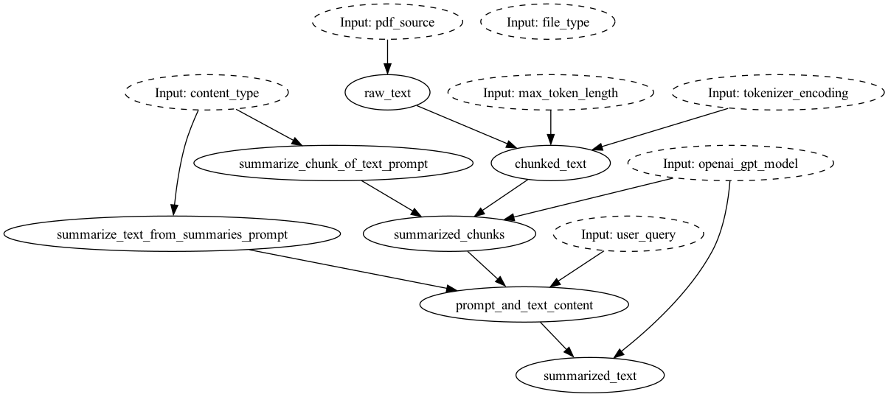

# a dataflow

import CodeBlock from '@theme/CodeBlock';



## To get started:
### Dynamically pull and run
import example from '!!raw-loader!./example1.py';

<CodeBlock language="python">{example}</CodeBlock>


### Use published library version
```bash
pip install sf-hamilton-contrib  # make sure you have the latest
```

import example2 from '!!raw-loader!./example2.py';

<CodeBlock language="python">{example2}</CodeBlock>

## Purpose of this module
This module implements a dataflow to summarize text hitting the OpenAI API.

You can pass in PDFs, or just text and it will get chunked and summarized by the OpenAI API.

## Configuration Options
This module can be configured with the following options:
 - {"file_type":  "pdf"} to read PDFs.
 - {"file_type":  "text"} to read a text file.
 - {} to have `raw_text` be passed in.

## config json viewer? or something like that
import valid_configs from '!!raw-loader!./valid_configs.jsonl';

<CodeBlock language="json">{valid_configs}</CodeBlock>

import Tabs from '@theme/Tabs';
import TabItem from '@theme/TabItem';


export const ConfigView = (props) => (
    <Tabs>
      <TabItem value="apple" label="Apple" default>
        This is an apple 🍎
      </TabItem>
      <TabItem value="orange" label="Orange">
        This is an orange 🍊
      </TabItem>
      <TabItem value="banana" label="Banana">
        This is a banana 🍌
      </TabItem>
    </Tabs>
);

<ConfigView />


## Limitations

This module is limited to OpenAI.

It does not check the context length, so it may fail if the context is too long.

## Source code


import MyComponentSource from '!!raw-loader!./__init__.py';

<CodeBlock language="python">{MyComponentSource}</CodeBlock>


## Requirements
import requirements from '!!raw-loader!./requirements.txt';

<CodeBlock language="text">{requirements}</CodeBlock>
